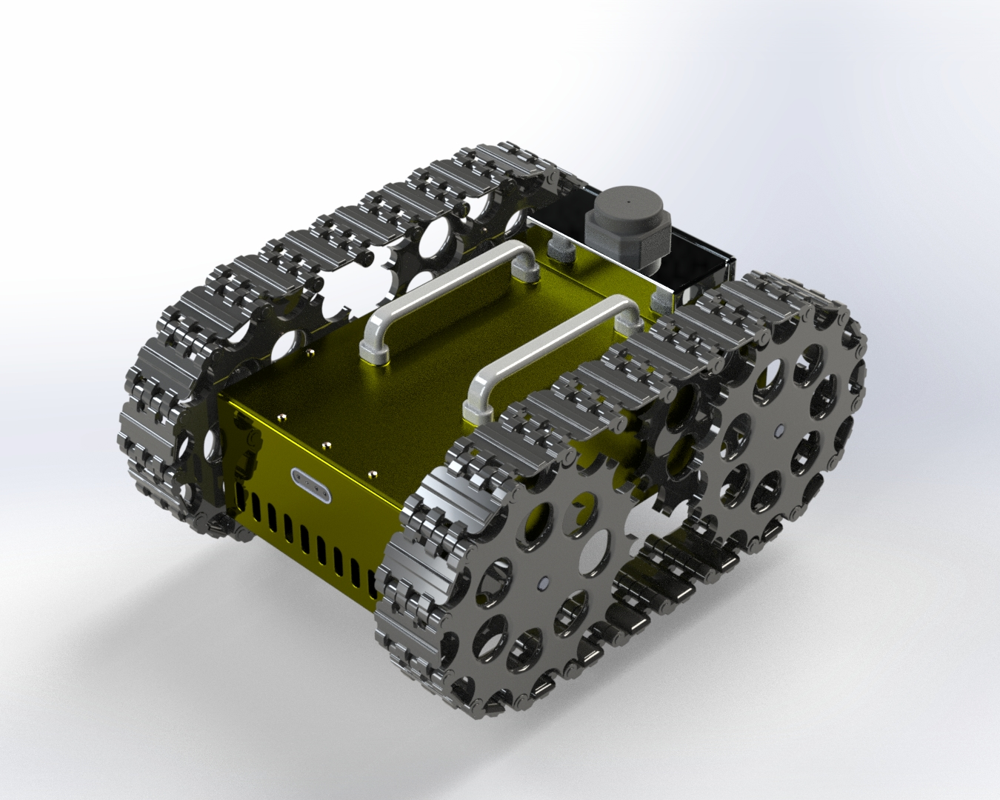

# **Development of a Mobile Robot for Autonomous & Manual Inspection of Confined Spaces Using Multi-Sensor Detection Systems**  

This repository contains the code, simulations, and documentation for my final-year internship project. The project focuses on designing and developing an autonomous mobile robot equipped with a **multi-sensor detection system** for navigating and inspecting confined spaces. The system supports both **autonomous** and **manual navigation**, making it adaptable to various inspection scenarios.  

## **Project Overview**  
🚀 **Autonomous & Manual Navigation**: Supports **autonomous path planning** and **manual control via RF remote interface**.  
🔍 **Multi-Sensor**: Integrated **LiDAR, stereo cameras, IMU, motor encoders, gas sensors, and temperature & humidity sensors** for comprehensive environmental monitoring.

🛠 **PCB Modular Sensor Hub**: Designed to adapt to multiple **sensors**.  
🎯 **Embedded Systems Development**: Developed firmware for **Jetson and STM32**.  
📊 **Structural & Thermal Analysis**: Conducted **FEA for vibration and load assessment** and **CFD for electronics cooling optimization** using **ANSYS**.  

## **Features**  
- **Autonomous Navigation**: ROS-based path planning and obstacle avoidance.  
- **Manual Navigation**: Remote control via a radiomaster.  
- **Multi-Sensor**:  
  - **LiDAR & Stereo Cameras** → Mapping & Obstacle Detection  
  - **IMU & Encoders** → Precise Localization  
  - **Gas, Temperature & Humidity Sensors** → Environmental Monitoring  
- **Gazebo-Based Simulation**: Virtual environment for testing and validation.  
- **ROS Integration**: Efficient robot control, mapping, and localization.  
- **PCB Modular Sensor Hub**: Compatible with different sensors for flexibility.  
- **Embedded Control**: Jetson for processing & STM32 for sensor acquisition and motor control.  
- **Structural & Thermal Optimization**: Vibration & Load Analysis ,Thermal Management for Electronics 

## **Contents**  
📂 **Code**: Navigation algorithms, sensor fusion logic, embedded firmware, and ROS nodes.  
📄 **Documentation**: System architecture, hardware design, sensor integration, and experimental results.  
🏗 **Simulations**: Gazebo environments for real-world scenario validation.  

## **Technologies Used**  
- **Programming Languages**: Python , C/C++  
- **Frameworks & Tools**: ROS2, OpenCV
- **Computer Aided design**: Solidworks
- **Simulation & Analysis**: Gazebo , ANSYS 
- **Hardware**: **LiDAR, stereo cameras, IMU, motor encoders, gas sensors, temperature & humidity sensors, Jetson, STM32**  

## **Contributing**  
Contributions are welcome! Feel free to submit issues, feature requests, or pull requests.  

## **Contact**  
For inquiries or collaboration, reach out via moataz.seghyar@usmba.ac.ma or connect on my linkedin page at Moataz Seghyar.  
